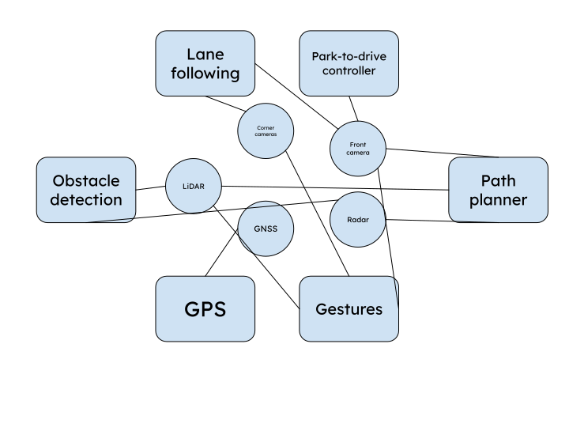

::: {.hero-section}

# Passenger Pickup {.title}

::: {.subtitle}
A Simple Passenger Collection System Triggered by Gestures
:::

::: {.author-list}

[**Agastya Pawate**](https://example.com)^1^,
[**Ethan Cao**](https://example.com)^1^,
[**Hyunjun An**](https://example.com)^1^

:::

::: {.affiliation-list}

^1^ The University of Illinois Urbana Champaign

:::

::: {.button-row}

[[ Paper]{.btn-text}](https://arxiv.org/pdf/XXXX.XXXXX){.btn .btn-primary}
[[ arXiv]{.btn-text}](https://arxiv.org/abs/XXXX.XXXXX){.btn .btn-primary}
[[ Video]{.btn-text}](https://www.youtube.com/watch?v=cSQTZoZPJzs){.btn .btn-primary}
[[ Code]{.btn-text}](https://github.com/){.btn .btn-primary}
[[ Data]{.btn-text}](https://example.com){.btn .btn-primary}

:::

:::


<!-- ============================================================ -->
<!-- TEASER IMAGE / VIDEO -->
<!-- ============================================================ -->

::: {.section-container}

::: {.hero-teaser}

<!-- Option A: Use a static image as the teaser -->
{.teaser-img}

<!-- Option B: Embed a video teaser (uncomment below, comment out image above)

-->

:::

:::


<!-- ============================================================ -->
<!-- ABSTRACT -->
<!-- ============================================================ -->

::: {.section-container}

## Abstract {.section-title}

::: {.abstract-text}
<!-- Replace this text with your project abstract. Describe the problem you are
solving, the key insight or contribution of your work, and the main results.
Keep it concise — typically 150–250 words. You can use **bold** and *italic*
formatting to emphasize key terms. -->

We present a novel approach to collecting passengers that focuses on ease of use and convenience. 
Our method leverages computer vision and path planning
to overcome the difficulty of app based ride hailing solutions. 
<!-- Experiments demonstrate that our
approach outperforms existing methods by [metric improvement] while requiring
[efficiency gain]. -->
:::

:::

::: {.section-container}

## Problem {.section-title}

::: {.content-text}
The problem of crossing spaces such as parking lots may seem trivial to able bodied individuals, but being able to quickly
and safely move short distances may be more difficult for those who are disabled. Currently, app based mobility solutions 
are only designed for traveling longer distances and do not solve the problem of crossing a busy street or parking lot.

:::

:::

::: {.section-container}

## Solution {.section-title}

::: {.content-text}
We propose a solution which utilizes the GEM autonomous vehicle and its capabilities to traverse a parking lot while avoiding obstacles on the way to a would-be passenger.
The GEM vehicle will recognize gestures such as a waving motion and autonomously navigate to the passenger's location. Alternatively, a phone can be used to call the vehicle. 
Through the use of these measures, we aim to make passenger pickup as seamless and safe as possible.

:::

:::

::: {.section-container}

## Current Progress {.section-title}

::: {.content-text}
Currently, we are in the brainstorming stage of our design process. 
We have split up the tasks for this project amongst our group members and have run some test code in the simulator as shown below.

:::

:::

::: {.section-container}

## Task Distribution {.section-title}

::: {.content-text}
Our three team members will focus on the following tasks. Agastya will focus on GPS coordinate data transmission from mobile devices, obstacle detection and distance estimation.
Ethan will focus on lane following algorithms, gesture detection, and face recognition. 
Hyunjun will focus on the park-to-drive controller and path planning.
:::

:::


<!-- ============================================================ -->
<!-- OVERVIEW / METHOD VIDEO -->
<!-- ============================================================ -->

::: {.section-container}

## Video of Simulator from Earlier Work {.section-title}

::: {.video-container}
<!-- Replace with your YouTube or local video embed -->

:::

:::


<!-- ============================================================ -->
<!-- RESULTS GALLERY -->
<!-- ============================================================ -->

<!-- ::: {.section-container}

## Results {.section-title}

::: {.content-text}
Provide a brief description of the results shown below. Explain what the
reader should observe and why it matters.
:::

::: {.results-grid}

::: {.result-card}

:::

::: {.result-card}

:::

::: {.result-card}

:::

:::

::: -->


<!-- ============================================================ -->
<!-- QUALITATIVE COMPARISONS -->
<!-- ============================================================ -->

<!-- ::: {.section-container}

## Qualitative Comparisons {.section-title}

::: {.content-text}
Describe the comparison setup — which baselines are you comparing against, and
what should the reader look for in the side-by-side results.
:::

::: {.comparison-grid}

::: {.comparison-item}


**Ours**
:::

::: {.comparison-item}


**Baseline A**
:::

:::

::: -->


<!-- ============================================================ -->
<!-- INTERACTIVE SLIDER (Optional) -->
<!-- ============================================================ -->

<!-- ::: {.section-container}

## Interpolation Demo {.section-title}

::: {.content-text}
If your method supports interpolation or continuous control, you can add an
interactive slider here. The example below shows how to set one up.
:::

::: {.interpolation-panel}

::: {.interpolation-endpoints}
{.endpoint-img}

{.endpoint-img}
:::

<input type="range" min="0" max="100" value="50" class="interpolation-slider" id="interpolation-slider">
<div id="interpolation-value" class="interpolation-value">50%</div>

<script>
  const slider = document.getElementById('interpolation-slider');
  const display = document.getElementById('interpolation-value');
  slider.addEventListener('input', function() {
    display.textContent = this.value + '%';
  });
</script>

:::

::: -->


<!-- ============================================================ -->
<!-- RELATED WORK -->
<!-- ============================================================ -->

<!-- ::: {.section-container}

## Related Work {.section-title}

::: {.content-text}

Here are some related works in this area:

- [Related Paper 1](https://example.com) introduces an idea similar to ours for [topic].
- [Related Paper 2](https://example.com) also addresses [problem] using [approach].
- [Related Paper 3](https://example.com) proposes [technique] which is complementary to our method.

Check out [this survey](https://example.com) for a comprehensive overview of the field.
:::

::: -->


<!-- ============================================================ -->
<!-- BIBTEX -->
<!-- ============================================================ -->

::: {.section-container}

## BibTeX {.section-title}

```bibtex
@article{team2842026finalproject,
  author    = {Hyunjun An and Ethan Cao and Agastya Pawate},
  title     = {Passenger Pickup},
  journal   = {ECE 484: Safe Autonomy},
  year      = {2026},
}
```

:::


<!-- ============================================================ -->
<!-- FOOTER -->
<!-- ============================================================ -->

::: {.site-footer}

This website template is adapted from the
[Nerfies](https://nerfies.github.io) project page, which is licensed under a
[Creative Commons Attribution-ShareAlike 4.0 International License](http://creativecommons.org/licenses/by-sa/4.0/).

:::
