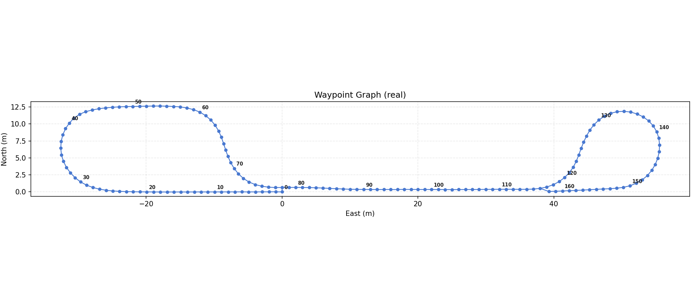
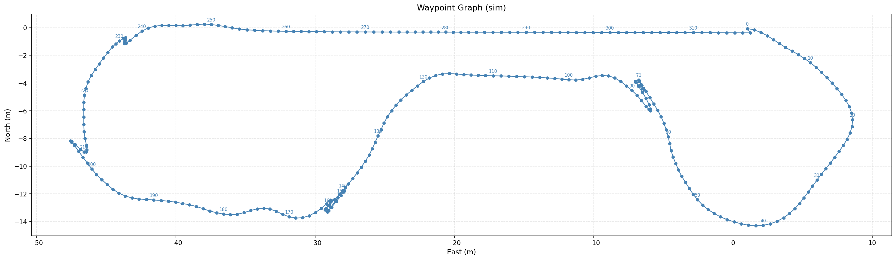
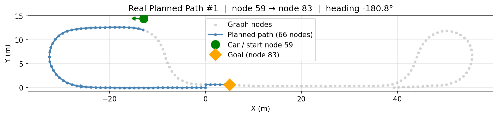
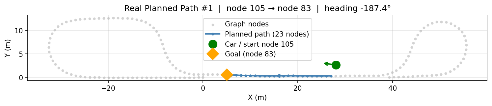
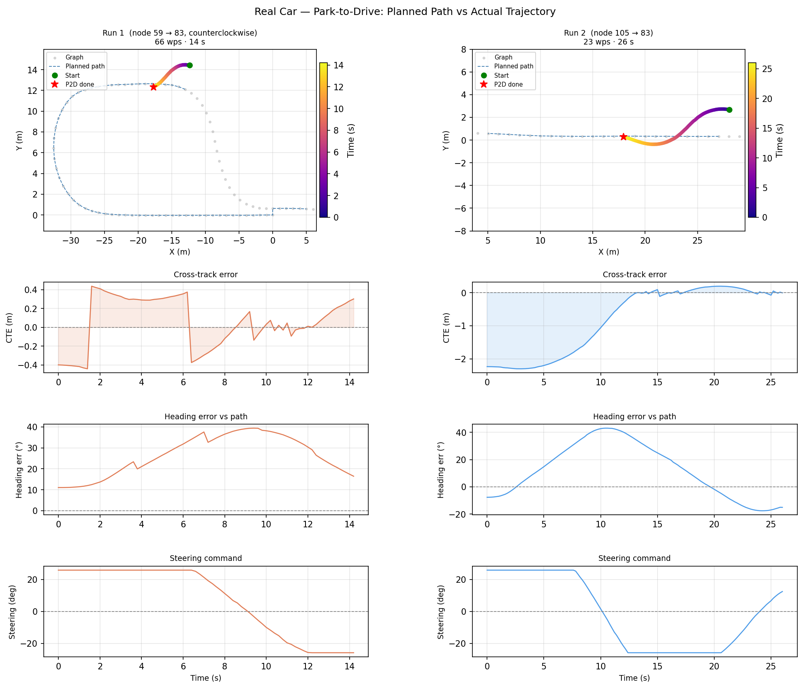
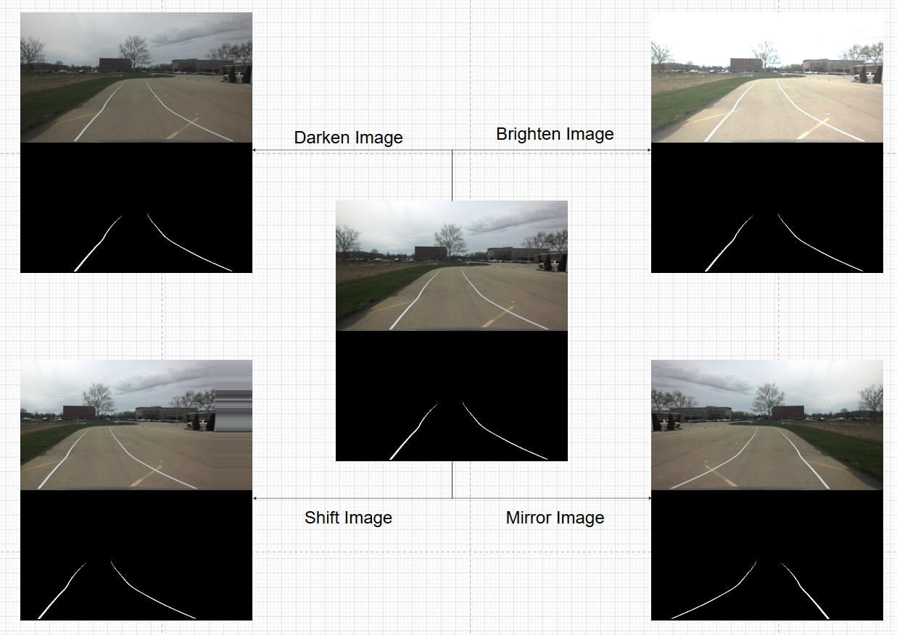
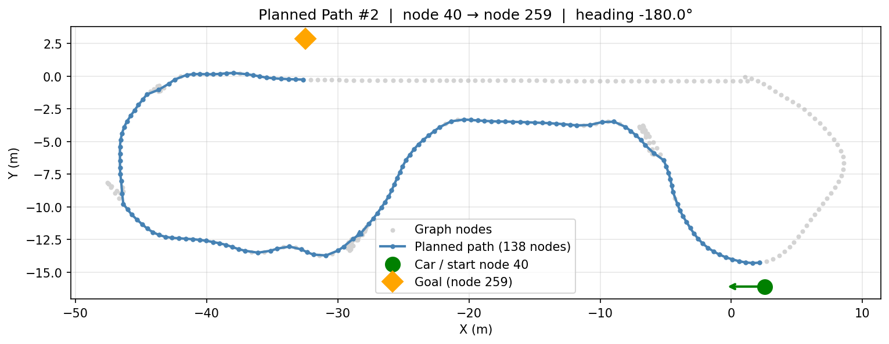
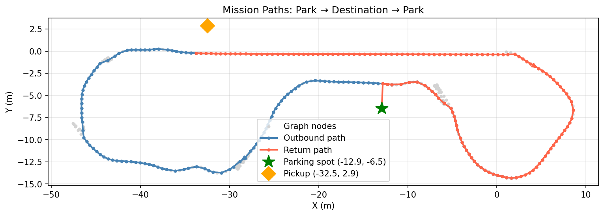
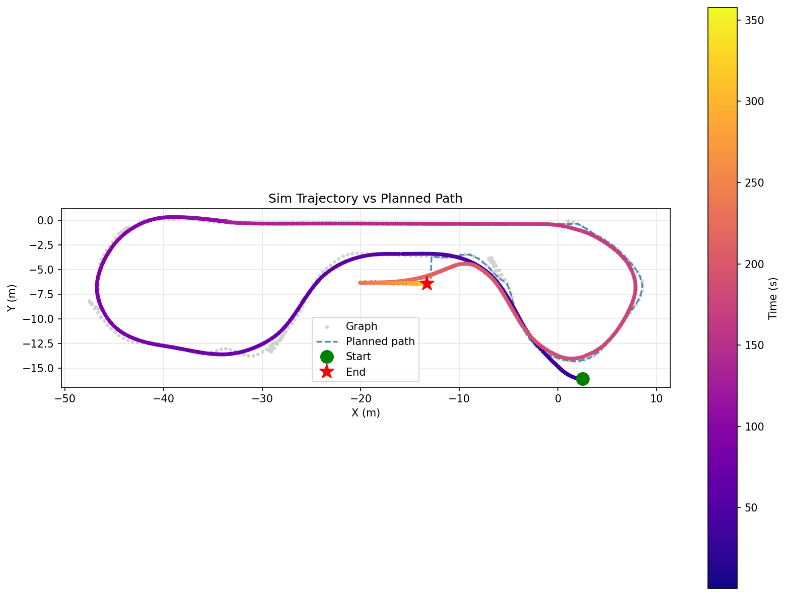

::: {.hero-section}

# Passenger Pickup {.title}

::: {.subtitle}
A Simple Passenger Collection System
:::

::: {.author-list}

[**Agastya Pawate**](https://example.com)^1^,
[**Ethan Cao**](https://example.com)^1^,
[**Hyunjun An**](https://example.com)^1^

:::

::: {.affiliation-list}

^1^ The University of Illinois Urbana Champaign

:::

::: {.button-row}

[[ Paper]{.btn-text}](https://arxiv.org/pdf/XXXX.XXXXX){.btn .btn-primary}
[[ arXiv]{.btn-text}](https://arxiv.org/abs/XXXX.XXXXX){.btn .btn-primary}
[[ Video]{.btn-text}](https://www.youtube.com/watch?v=cSQTZoZPJzs){.btn .btn-primary}
[[ Code]{.btn-text}](https://github.com/){.btn .btn-primary}
[[ Data]{.btn-text}](https://example.com){.btn .btn-primary}

:::

:::


::: {.section-container}

::: {.hero-teaser}

{.teaser-img}

:::

:::


::: {.section-container}

## Final Demo Video {.section-title}

::: {.video-container}

:::

:::


:::  {.section-title}
## Introduction & System Overview
:::

Our project utilizes the GEM autonomous vehicle to navigate a track, avoid obstacles, and autonomously reach a passenger after being summoned via a mobile app. To achieve this, we developed three primary subsystems:

- **Lane Follower:** Uses a neural network to mask lanes from camera feeds and fits polynomial lines to navigate the track.
- **Global Path Planner:** Utilizes the vehicle's GPS and odometry to generate and follow optimal waypoints to the target destination.
- **Obstacle Detector:** Processes LiDAR point clouds along the generated path to predict and prevent collisions.

Currently, the GEM e2 can successfully enter the track, navigate to its target, and reliably brake for obstacles until the path is clear.

:::  {.section-title}
## Task Distribution
:::

Our three team members focused on the following specific domains to achieve the project goals:

- **Agastya:** GPS coordinate data transmission from mobile devices, obstacle detection, and distance estimation.
- **Ethan:** Lane following algorithms and overall system integration.
- **Hyunjun:** Park-to-drive controller and global path planning.

::: {.section-title}
## Approach & Methodology 
:::

**Key Methods & Iterations:**

- **Lane Detection Iterations:** We initially attempted to reuse an MP1 lane segmentation model using basic cropping and color masking, which proved unreliable. We have since trained a new neural network using real and generated data, and are considering more complex solutions such as YOLO to consistently detect lane lines.
- **Control Systems:** To avoid the complexity of interfacing with the PACMod, our code initially outputted joystick commands on the `/joy` topic. Due to a lack of closed-loop control, speed was highly erratic, causing the car to move too fast or not at all. We resolved this by implementing a closed-loop PID controller to regulate vehicle speed smoothly.
- **Node Modularity:** We found that complex nodes were difficult to develop, as contributors needed to comb through lots of code to understand what was going on. Our team decided to leverage the modular nature of ROS to divide complex problems into multiple smaller nodes, allowing for easier collaboration and greater code clarity.
- **Centralized Control Hierarchy:** Another issue we encountered was the controller detecting obstacles but failing to brake due to a lack of a centralized "stop" topic, meaning driver input could partially override stop commands. We centralized all our submodules' data into common topics that can be read from, allowing us to implement a priority hierarchy for our system.
- **Dynamic Obstacle Safety Region:** The controller occasionally detected nearby obstacles, such as buildings, despite the path not intersecting with them. We fixed this by turning the obstacle detector's unsafety region into a region bounded by quadratics fitted to the upcoming waypoints from the global path planner, ensuring the GEM e2 only halts for obstacles directly in its path.
 
**Waypoint Graph Generation & Path Planning** 

We created a graph of waypoints to better support bi-directional, optimal path generation. The graph is undirected and uses the real distance between nodes as edge weights. Waypoints are sampled at ~1m intervals, resulting in 163 nodes (real world) and 318 nodes (simulation). 


::: {.results-grid style="align-items: center;"}
::: {.result-card}
{width="100%"}
:::
::: {.result-card}
{width="100%"}
:::
:::

Our path planner is based on Dijkstra's algorithm, chosen because the small number of nodes results in minimal computation time difference with other algorithms (A*), while remaining optimal and simple to implement. To account for heading-aware planning, we made the planner to only consider a path that can be achieved by current heading by giving penalty (cost of 500m) if it tries to generate unachievable path. Planner also publishes `/next_turn` to determine which lane to follow at junctions. 

::: {.results-grid}
::: {.result-card}

:::
::: {.result-card}

:::

:::

**Park to Drive controller** 

Park-to-drive is capable of driving from an arbitrary parking spot onto the track. Stanley controller is selected as it can account for both cross-track error and heading error at the same time. Once the vehicle joins the track, control is delegated to the lane follower (pure pursuit-based).

$$\delta = -e_{heading} - \arctan\!\left(\frac{k \cdot e_{cte}}{v}\right)$$

::: {.figure-caption}
$\delta$: steering angle, $e_{heading}$: heading error, $e_{cte}$: cross-track error, $k$: gain, $v$: speed
:::

$$(\text{d} < 2\text{m} \land c \geq 0.9 \land t \geq 0.5\text{s}) \lor (\text{d} < 0.5\text{m} \land |e_{heading}| < 15°)$$

::: {.figure-caption}
$\text{d}$: distance from vehicle to current nearest path waypoint, $c$: lane detection confidence score, $t$: duration above threshold, $e_{heading}$: heading error
:::




**Data Generation:**

Since our driving data is collected on a cloudy day, we wanted to simulate a sunny day by brightening and increasing the contrast of our images.
Additionally, to provide more training data for our lane detector, we performed a combination of image mirrors and shifts. In the end, our 133 raw images were turned into a training set with 5586 images.
Testing showed that our lane follower was very resistant to weather and lighting changes despite only being trained on one lap of driving.

{height="500px"} 


**Lane Follower Flowchart:**

asdfsda


::: {.section-title}
## Results & Milestones 
:::

**Milestones Achieved:**

1. **Simulator:** Successfully tested lane following, path planning, park to drive, and drive to park in the GEM Simulator.
2. **Hardware Actuation:** Successfully controlled the physical GEM car via ackermann commands using our ROS nodes.
3. **Hardware Perception:** Successfully integrated lane detection, park to drive, global path planning, and LiDAR obstacle detection on the physical GEM vehicle.
:::
### Quantitative Data

**Obstacle Detection Metrics**


::: {.section-title}
## Demonstrations 
:::
### Hardware Demonstrations

::: {.video-container}
<p><b>Data Collection & Waypoint Generation: </b> Highbay testing to map GPS data to real-world waypoints.</p>

:::

::: {.video-container}
<p><b>Lane Detection on GEM:</b> Real-time hardware testing of the perception stack.</p>

:::

::: {.video-container}
<p><b>Obstacle Detection on GEM:</b> Verifying LiDAR point cloud processing.</p>

:::

::: {.video-container}
<p><b>Joystick Driving Test:</b> Controlling the GEM car with a gamepad.</p>

:::

::: {.video-container}
<p><b>Failed Lane Follower Test:</b> Previous iteration showing inconsistent lane tracking before improvements.</p>

:::

### Software / Simulation Demonstrations

::: {.video-container}
<p><b>Fully-Integrated System Demonstration:</b> </p>

:::

::: {.results-grid}
::: {.result-card}

:::
::: {.result-card}

:::
:::

{width="50%"}

::: {.video-container}
<p><b>Simulated Lane Detection:</b></p>

:::

::: {.video-container}
<p><b>LiDAR Obstacle Detection (RViz):</b> Visualizing the ROSBAG data collected.</p>

:::


::: {.section-container}

## BibTeX {.section-title}

```bibtex
@article{team2842026finalproject,
  author    = {Hyunjun An and Ethan Cao and Agastya Pawate},
  title     = {Passenger Pickup},
  journal   = {ECE 484: Safe Autonomy},
  year      = {2026}
}
```
:::

::: {.site-footer}

This website template is adapted from the
Nerfies project page, which is licensed under a
Creative Commons Attribution-ShareAlike 4.0 International License.
:::