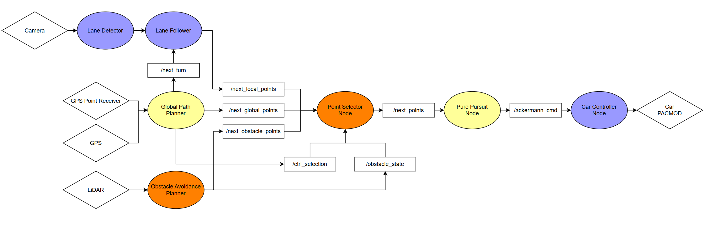
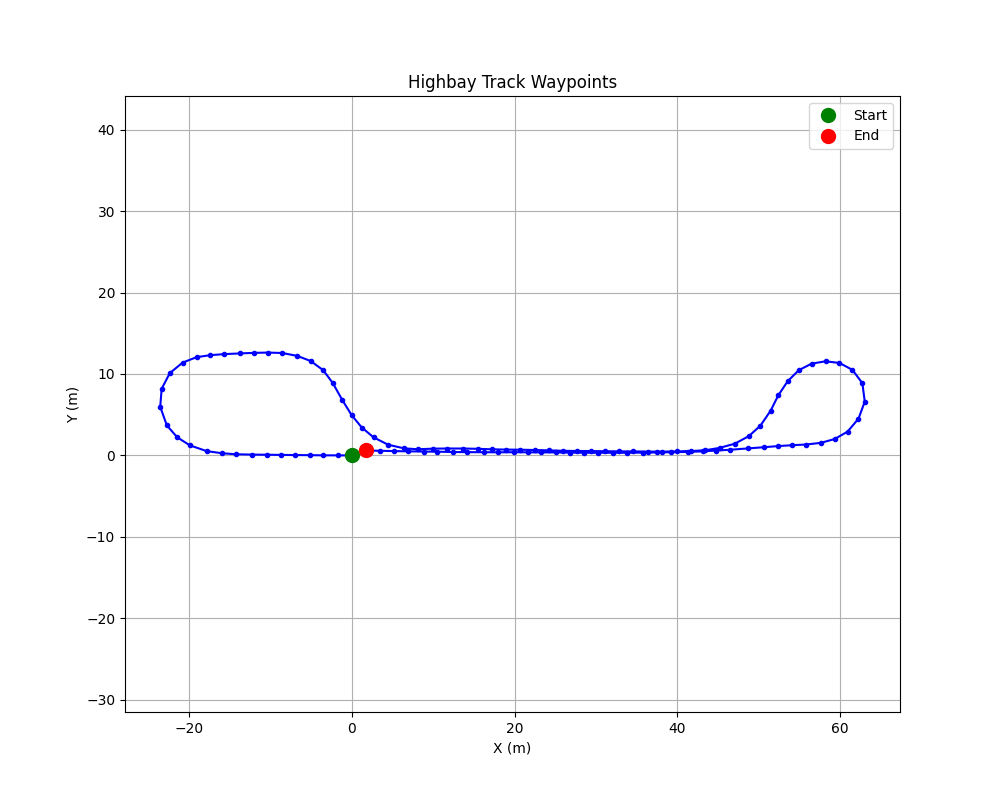
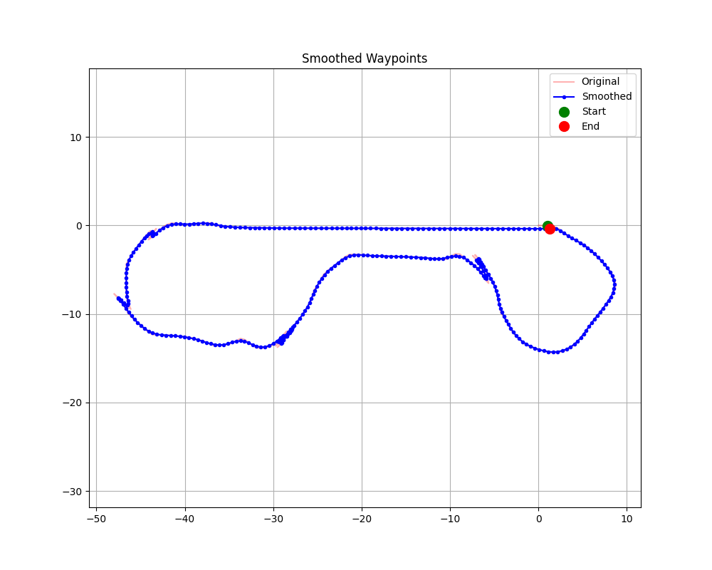
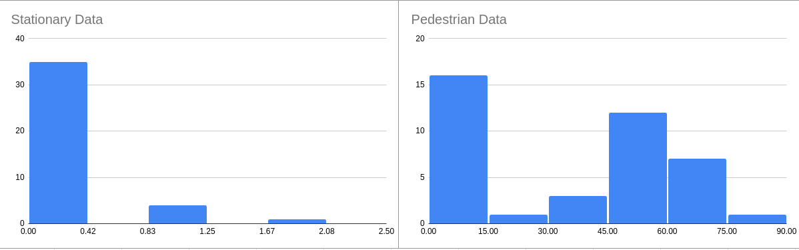
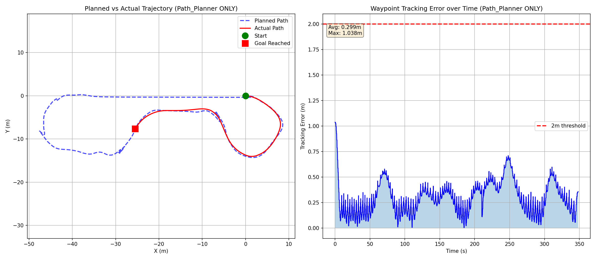
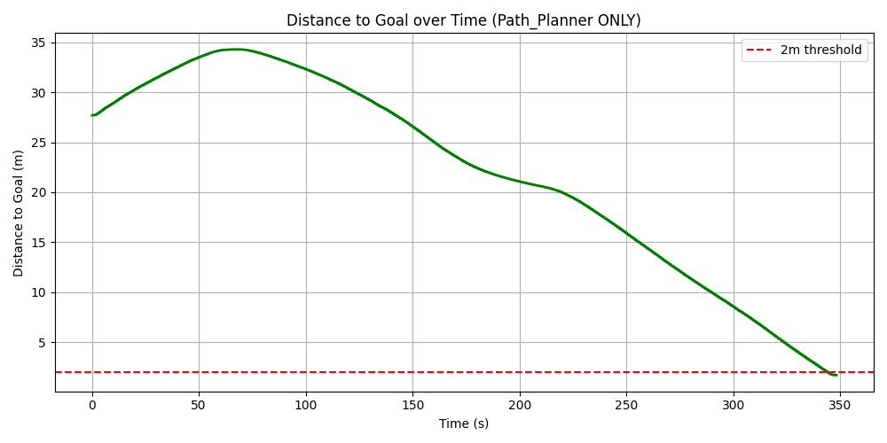
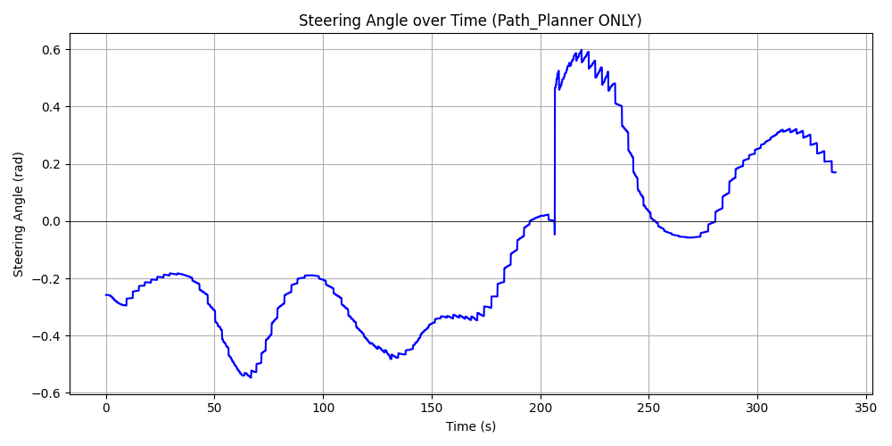
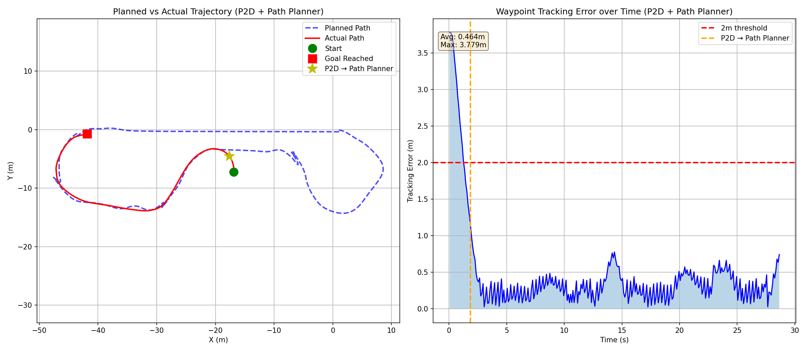
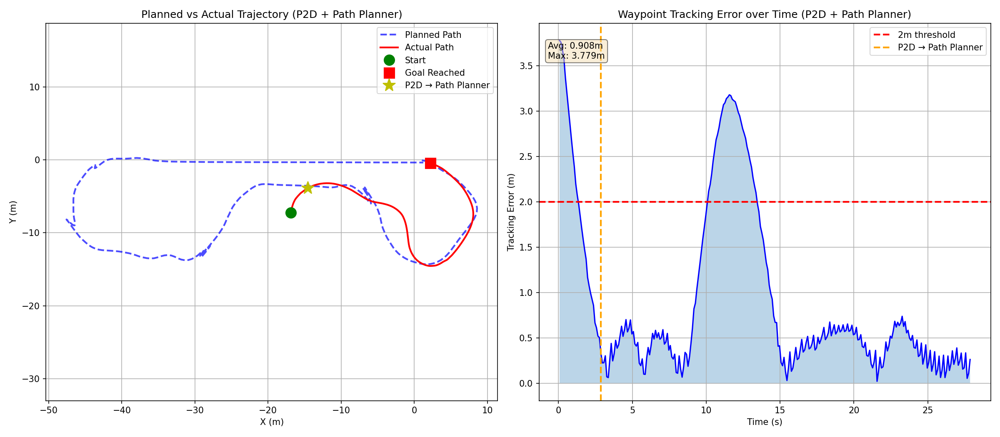

::: {.hero-section}

# Passenger Pickup {.title}

::: {.subtitle}
A Simple Passenger Collection System
:::

::: {.author-list}

[**Agastya Pawate**](https://example.com)^1^,
[**Ethan Cao**](https://example.com)^1^,
[**Hyunjun An**](https://example.com)^1^

:::

::: {.affiliation-list}

^1^ The University of Illinois Urbana Champaign

:::

::: {.button-row}

[[ Paper]{.btn-text}](https://arxiv.org/pdf/XXXX.XXXXX){.btn .btn-primary}
[[ arXiv]{.btn-text}](https://arxiv.org/abs/XXXX.XXXXX){.btn .btn-primary}
[[ Video]{.btn-text}](https://www.youtube.com/watch?v=cSQTZoZPJzs){.btn .btn-primary}
[[ Code]{.btn-text}](https://github.com/){.btn .btn-primary}
[[ Data]{.btn-text}](https://example.com){.btn .btn-primary}

:::

:::


<!-- ============================================================ -->
<!-- TEASER IMAGE / VIDEO -->
<!-- ============================================================ -->

::: {.section-container}

::: {.hero-teaser}

<!-- Option A: Use a static image as the teaser -->
{.teaser-img}


<!-- Option B: Embed a video teaser (uncomment below, comment out image above)

-->

:::

:::


<!-- ============================================================ -->
<!-- ABSTRACT -->
<!-- ============================================================ -->

::: {.section-container}

## Abstract {.section-title}

:::
<!-- Replace this text with your project abstract. Describe the problem you are
solving, the key insight or contribution of your work, and the main results.
Keep it concise — typically 150–250 words. You can use **bold** and *italic*
formatting to emphasize key terms. -->
We propose a solution which utilizes the GEM autonomous vehicle and its capabilities to traverse a track while avoiding obstacles on the way to a would-be passenger.
The GEM vehicle will autonomously navigate to the passenger's location after being called through a phone app.

<!-- Experiments demonstrate that our
approach outperforms existing methods by [metric improvement] while requiring
[efficiency gain]. -->


::: {.section-container}

## Task Distribution {.section-title}

:::
Our three team members will focus on the following tasks. Agastya will focus on GPS coordinate data transmission from mobile devices, obstacle detection and distance estimation.
Ethan will focus on lane following algorithms, and system integration.
Hyunjun will focus on the park-to-drive controller and global path planning.


::: {.section-container}

## Current Progress {.section-title}

::: 
So far, the team has visited the highbay 2 times to conduct real-world data collection and testing.
We collected Rosbags of the stationary car, driving around the track, and people walking in front of a stationary car.
We have tested lane detection, lane following, and obstacle detection.

::: {.video-container}

:::

Using the GPS data from the rosbag, we were able to generate the waypoints.

::: {.results-grid}

::: {.result-card}

:::

::: {.result-card}

:::

:::


Here is a video of lane detection in the GEM simulator

::: {.video-container}

:::

Here is a video of waypoint following, path planner, and park-to-drive in the GEM simulator

::: {.video-container}

:::
::: {.video-container}

:::
::: {.video-container}

:::
Here is a video of LIDAR obstacle detection in RViz using the ROSBAG collected

::: {.video-container}

:::

Here is a video of testing lane detection in the GEM car

::: {.video-container}

:::

Here is a video of controlling the GEM car with a gamepad

::: {.video-container}

:::

Here is a video of testing obstacle detection in the GEM car

::: {.video-container}

:::


::: {.section-container}
## What Didn't Work {.section-title}
:::
- Initially, we tried to reuse the lane segmentation model trained for MP1 to detect lane lines. A mix of cropping and color masking was tried but ultimately did not produce great results. 
We will try both retraining the model on data from the highbay and using more complex solutions such as YOLO to consistently detect lane lines.

::: {.video-container}

:::

- To avoid the complexity of interfacing with the PACMod, our code outputs joystick commands on the /joy topic.
While this does work to control the car, we found that the lack of closed loop control made the speed of the car uncontrollable.
Most of the time, the car would either be too fast or not move at all.
We are working on a PID controller to control the speed of the car. 

- We found that more complex nodes were difficult to develop, as contributors needed to comb through lots of code to understand what was going on within a node.
Our team decided to leverage the modular nature of ROS to divide complex problems into multiple nodes.
Smaller, less complex nodes allow for easier collaboration, and greater code clarity. 

- Another minor issue we had was with the controller detecting obstacles but failing to brake for them. We found that this was due to the lack of a centralized "stop" topic for nodes to publish to, meaning that driver input could partially override stop commands.
One of the major changes that we plan to make in the coming days is the centralization of all our submodules' data into common topics that can be read from. This will allow us to implement a priority hierarchy for our system and will be a major step forward towards integrating all modules into a single self-driving setup.

::: {.section-container}

::: {.section-container}
## Initial Simulator Setup {.section-title}
::: {.video-container}

:::

:::


<!-- ============================================================ -->
<!-- RESULTS GALLERY -->
<!-- ============================================================ -->

::: {.section-container}

## Results {.section-title}

:::

::: {.content-text}
Below are graphs of some of the data we have collected thus far.
:::


### Obstacle Detection Data




### Path Planning: Origin to a Random Point on the Road

Starting from the simulation map origin (x=0, y=0, yaw=0), the path planner generates and executes a trajectory to a randomly selected point on the road.








### Park-to-Drive + Path Planner

The Park-to-Drive (P2D) controller first maneuvers the vehicle out of an arbitrary parking spot. Once the vehicle reaches the first waypoint of the global path, control is handed over to the path planner, which then guides the vehicle to its final destination. We will fuse lane follower into this. 






<!-- ============================================================ -->
<!-- QUALITATIVE COMPARISONS -->
<!-- ============================================================ -->

<!-- ::: {.section-container}

## Qualitative Comparisons {.section-title}

::: {.content-text}
Describe the comparison setup — which baselines are you comparing against, and
what should the reader look for in the side-by-side results.
:::

::: {.comparison-grid}

::: {.comparison-item}


**Ours**
:::

::: {.comparison-item}


**Baseline A**
:::

:::

::: -->


<!-- ============================================================ -->
<!-- INTERACTIVE SLIDER (Optional) -->
<!-- ============================================================ -->

<!-- ::: {.section-container}

## Interpolation Demo {.section-title}

::: {.content-text}
If your method supports interpolation or continuous control, you can add an
interactive slider here. The example below shows how to set one up.
:::

::: {.interpolation-panel}

::: {.interpolation-endpoints}
{.endpoint-img}

{.endpoint-img}
:::

<input type="range" min="0" max="100" value="50" class="interpolation-slider" id="interpolation-slider">
<div id="interpolation-value" class="interpolation-value">50%</div>

<script>
  const slider = document.getElementById('interpolation-slider');
  const display = document.getElementById('interpolation-value');
  slider.addEventListener('input', function() {
    display.textContent = this.value + '%';
  });
</script>

:::

::: -->


<!-- ============================================================ -->
<!-- RELATED WORK -->
<!-- ============================================================ -->

<!-- ::: {.section-container}

## Related Work {.section-title}

::: {.content-text}

Here are some related works in this area:

- [Related Paper 1](https://example.com) introduces an idea similar to ours for [topic].
- [Related Paper 2](https://example.com) also addresses [problem] using [approach].
- [Related Paper 3](https://example.com) proposes [technique] which is complementary to our method.

Check out [this survey](https://example.com) for a comprehensive overview of the field.
:::

::: -->


<!-- ============================================================ -->
<!-- BIBTEX -->
<!-- ============================================================ -->

::: {.section-container}

## BibTeX {.section-title}

```bibtex
@article{team2842026finalproject,
  author    = {Hyunjun An and Ethan Cao and Agastya Pawate},
  title     = {Passenger Pickup},
  journal   = {ECE 484: Safe Autonomy},
  year      = {2026},
}
```

:::


<!-- ============================================================ -->
<!-- FOOTER -->
<!-- ============================================================ -->

::: {.site-footer}

This website template is adapted from the
[Nerfies](https://nerfies.github.io) project page, which is licensed under a
[Creative Commons Attribution-ShareAlike 4.0 International License](http://creativecommons.org/licenses/by-sa/4.0/).

:::
