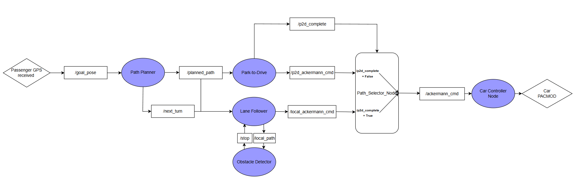
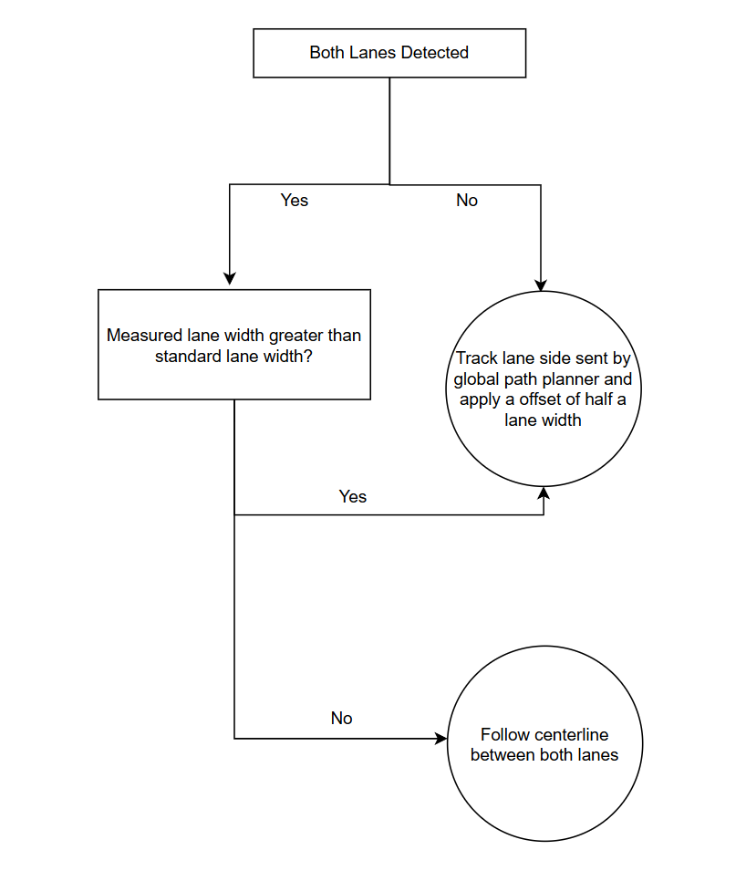

::: {.hero-section}

# Robotaxi {.title}

::: {.subtitle}
A Simple Passenger Collection System
:::

::: {.author-list}

[**Agastya Pawate**](https://example.com)^1^,
[**Ethan Cao**](https://example.com)^1^,
[**Hyunjun An**](https://example.com)^1^

:::

::: {.affiliation-list}

^1^ The University of Illinois Urbana Champaign

:::

::: {.button-row}

[[ Paper]{.btn-text}](https://arxiv.org/pdf/XXXX.XXXXX){.btn .btn-primary}
[[ arXiv]{.btn-text}](https://arxiv.org/abs/XXXX.XXXXX){.btn .btn-primary}
[[ Video]{.btn-text}](https://www.youtube.com/watch?v=cSQTZoZPJzs){.btn .btn-primary}
[[ Code]{.btn-text}](https://github.com/){.btn .btn-primary}
[[ Data]{.btn-text}](https://example.com){.btn .btn-primary}

:::

:::


::: {.section-container}

::: {.hero-teaser}

{.teaser-img width="150%"}

:::

:::


::: {.section-container}

## Final Demo Video {.section-title}

::: {.video-container}

:::

:::


:::  {.section-title}
## Introduction & System Overview
:::

Our project utilizes the GEM autonomous vehicle to navigate a track, avoid obstacles, and autonomously reach a passenger after being summoned via a mobile app. To achieve this, we developed three primary subsystems:

- **Lane Follower:** Uses a neural network to mask lanes from camera feeds and fits polynomial lines to navigate the track.
- **Global Path Planner:** Utilizes the vehicle's GPS and odometry to generate and follow optimal waypoints to the target destination.
- **Obstacle Detector:** Processes LiDAR point clouds along the generated path to predict and prevent collisions.

Currently, the GEM e2 can successfully enter the track, navigate to its target, and reliably brake for obstacles until the path is clear.

:::  {.section-title}
## Task Distribution
:::

Our three team members focused on the following specific domains to achieve the project goals:

- **Agastya:** Obstacle detection and distance estimation.
- **Ethan:** Lane following algorithms and overall system integration.
- **Hyunjun:** Park-to-drive controller and global path planning.

::: {.section-title}
## Approach & Methodology 
:::

**Key Methods & Iterations:**

- **Lane Detection Iterations:** We initially attempted to reuse an MP1 lane segmentation model using basic cropping and color masking, which proved unreliable. We have since trained a new neural network using real and generated data, and are considering more complex solutions such as YOLO to consistently detect lane lines.
- **Control Systems:** To avoid the complexity of interfacing with the PACMod, our code initially outputted joystick commands on the `/joy` topic. Due to a lack of closed-loop control, speed was highly erratic, causing the car to move too fast or not at all. We resolved this by implementing a closed-loop PID controller to regulate vehicle speed smoothly.
- **Node Modularity:** We found that complex nodes were difficult to develop, as contributors needed to comb through lots of code to understand what was going on. Our team decided to leverage the modular nature of ROS to divide complex problems into multiple smaller nodes, allowing for easier collaboration and greater code clarity.
- **Centralized Control Hierarchy:** Another issue we encountered was the controller detecting obstacles but failing to brake due to a lack of a centralized "stop" topic, meaning driver input could partially override stop commands. We centralized all our submodules' data into common topics that can be read from, allowing us to implement a priority hierarchy for our system.
- **Dynamic Obstacle Safety Region:** The controller occasionally detected nearby obstacles, such as buildings, despite the path not intersecting with them. We fixed this by turning the obstacle detector's unsafety region into a region bounded by quadratics fitted to the upcoming waypoints from the global path planner, ensuring the GEM e2 only halts for obstacles directly in its path.
- **Absolute Heading via Septentrio Dual-Antenna GNSS:** ZED odometry provides only *relative* heading that resets on restart, making it unsuitable for global path planning. Instead, the Septentrio INS (`/insnavgeod`) provides absolute heading in NED (North, East, Down) convention, converted to ENU (East, North, UP) in degrees:

$$\psi_{ENU} = \frac{\pi}{2} - \psi_{NED} \cdot \frac{\pi}{180}$$

- **GPS → Local XY Coordinate Conversion:** All GPS coordinates are projected to a local ENU frame with the first graph node as origin:

$$x = R \cdot \Delta\lambda \cdot \cos(\phi_0), \qquad y = R \cdot \Delta\phi$$


::: {.figure-caption}
$R = 6{,}371{,}000$ m: Earth radius, $\Delta\lambda = \lambda - \lambda_0$: longitude offset (rad), $\Delta\phi = \phi - \phi_0$: latitude offset (rad), $(\phi_0, \lambda_0)$: origin node
:::

**Waypoint Graph Generation & Path Planning** 

We created a graph of waypoints to better support bi-directional, optimal path generation. The graph is undirected and uses the real distance between nodes as edge weights. Waypoints are sampled at ~1m intervals, resulting in 163 nodes (real world) and 318 nodes (simulation). 


::: {.results-grid style="align-items: center;"}
::: {.result-card}
{width="100%"}
:::
::: {.result-card}
{width="100%"}
:::
:::

Our path planner is based on Dijkstra's algorithm, chosen because the small number of nodes results in minimal computation time difference with other algorithms (A*), while remaining optimal and simple to implement. To account for heading-aware planning, we made the planner to only consider a path that can be achieved by current heading by giving penalty (cost of 500m) if it tries to generate unachievable path. Planner also publishes `/next_turn` to determine which lane to follow at junctions. 

::: {.results-grid}
::: {.result-card}

:::
::: {.result-card}

:::

:::

**Obstacle Detector**
The obstacle detector is capable of detecting obstacles with the approximate size of a human or a stop sign. We had two iterations for this module: V1 and V2.

**Obstacle Detector V1**

V1 of our obstacle detector utilized LIDAR to detect obstacles within a certain region in front of the GEM. We determined this optimized region by recording a ROSBAG of one of our teammates walking directly in front of the car and repeatedly running our algorithm on the ROSBAG data until satisfactory results were produced. 

**Obstacle Detector V2**

To further test version 1 of our algorithm, we recorded a ROSBAG with motion over the whole track and ran the obstacle detector on that. We soon encountered a significant issue: since the car had a fixed unsafety region in front of it, false positives would be thrown if the car happened to be pointed towards any building or foliage regardless of whether the path intersected with the obstacle or not. 

To fix this, we quadratically fitted the unsafety region to the path planner waypoints for version 2 of our algorithm. This produced far better results than version 1. For example, a full ROSBAG run around the whole track generated zero false positives with our new algorithm.

**Curve-Fitting Logic**

Our curve-fitting logic first uses np.polyfit() to fit a quadratic curve to the first six path waypoints in front of the GEM.

The derivative of a quadratic in general form is given by the equation below.

$$2ax+b$$

For each point in the list of waypoints, we calculate the above value as an approximation of the heading of the car at that point. We then take the inverse of this vector to get a new vector that is perpendicular to the heading. Using this new vector, we generate two offset groups of points on either side of the main path and fit new quadratics to these. Detecting an obstacle based on these equations is trivial, since we simply figure out whether the coordinates of a given LIDAR point fall between the two bounding quadratic equations.

**Park to Drive Controller** 

Park-to-drive is capable of driving from an arbitrary parking spot onto the track. Stanley controller is selected as it can account for both cross-track error and heading error at the same time. Once the vehicle joins the track, control is delegated to the lane follower (pure pursuit-based).

$$\delta = -e_{heading} - \arctan\!\left(\frac{k \cdot e_{cte}}{v}\right)$$

::: {.figure-caption}
$\delta$: steering angle, $e_{heading}$: heading error, $e_{cte}$: cross-track error, $k=0.5$: gain, $v=0.6$: speed. 
:::

$$(\text{d} < 2\text{m} \land c \geq 0.9 \land t \geq 0.5\text{s}) \lor (\text{d} < 0.5\text{m} \land |e_{heading}| < 15°)$$

::: {.figure-caption}
$\text{d}$: distance from vehicle to current nearest path waypoint, $c$: lane detection confidence score, $t$: duration above threshold, $e_{heading}$: heading error
:::


**Drive to Park Controller (in progress)**

Drive-to-Park returns the vehicle to the parking spot after passenger pickup. It is activated via `/activate_parking` and runs a two-phase controller:

**ALIGN** — Pure pursuit on a pre-generated axis of 15 waypoints (1 m spacing) through the parking spot along `park_theta`. Steering command:

$$\delta = \arctan\!\left(\frac{2L\sin\alpha}{d_{la}}\right)$$

::: {.figure-caption}
$L=1.75$ m: wheelbase, $\alpha$: angle to lookahead waypoint, $d_{la}$: lookahead distance. Phase exits when $|e_{cross}| < 0.12\text{m} \land |e_{heading}| < 2.5°$
:::

**PARK** — Drives straight ($\delta = 0$) along the axis to the exact parking coordinate with linear speed ramp-down from 4 m. Completes when $\text{dist} < 0.35\text{m} \land |e_{heading}| < 5°$.


**Data Generation:**

Since our driving data is collected on a cloudy day, we wanted to simulate a sunny day by brightening and increasing the contrast of our images.
Additionally, to provide more training data for our lane detector, we performed a combination of image mirrors and shifts. In the end, our 133 raw images were turned into a training set with 5586 images.
Testing showed that our lane follower was very resistant to weather and lighting changes despite only being trained on one lap of driving.

{height="500px"} 


**Lane Follower Flowchart:**
To make the lane follower work at intersections and when only a single lane is visible, we have implemented the following decision logic flowchart.

{height="400px"} 

**Obstacle Detection Comparison Graph:**
To determine an appropriate threshold for our obstacle detector, we utilized pedestrian and non-pedestrian ROSBAGS with LIDAR data from the GEM E2. We then graphed the number of points in the unsafety region for each scenario. This helped us finalize an unsafety threshold of around ten data points.


::: {.section-title}
## Results & Milestones 
:::

**Milestones Achieved:**

1. **Simulator:** Successfully tested lane following, path planning, park to drive, and drive to park in the GEM Simulator.
2. **Hardware Actuation:** Successfully controlled the physical GEM car via ackermann commands using our ROS nodes.
3. **Hardware Perception:** Successfully integrated lane detection, park to drive, global path planning, and LiDAR obstacle detection on the physical GEM vehicle.


::: {.section-title}
## Demonstrations 
:::
### Hardware Demonstrations

::: {.video-container}
<p><b>Data Collection & Waypoint Generation: </b> Highbay testing to map GPS data to real-world waypoints.</p>

:::

::: {.video-container}
<p><b>Lane Detection on GEM:</b> Real-time hardware testing of the perception stack.</p>

:::

::: {.video-container}
<p><b>Obstacle Detection on GEM:</b> Verifying LiDAR point cloud processing for V1 of Obstacle Detector.</p>

:::

::: {.video-container}
<p><b>Joystick Driving Test:</b> Controlling the GEM car with a gamepad.</p>

:::

::: {.video-container}
<p><b>Failed Lane Follower Test:</b> Previous iteration showing inconsistent lane tracking before improvements.</p>

:::

### Software / Simulation Demonstrations

::: {.video-container}
<p><b>Fully-Integrated System Demonstration:</b> </p>

:::

::: {.results-grid}
::: {.result-card}

:::
::: {.result-card}

:::
:::

{width="50%"}

::: {.video-container}
<p><b>Simulated Lane Detection:</b></p>

:::

::: {.video-container}
<p><b>LiDAR Obstacle Detection (RViz):</b> Visualizing the ROSBAG data collected.</p>

:::


::: {.section-container}

## BibTeX {.section-title}

```bibtex
@article{team2842026finalproject,
  author    = {Hyunjun An and Ethan Cao and Agastya Pawate},
  title     = {Passenger Pickup},
  journal   = {ECE 484: Safe Autonomy},
  year      = {2026}
}
```
:::

::: {.site-footer}

This website template is adapted from the
Nerfies project page, which is licensed under a
Creative Commons Attribution-ShareAlike 4.0 International License.
:::
